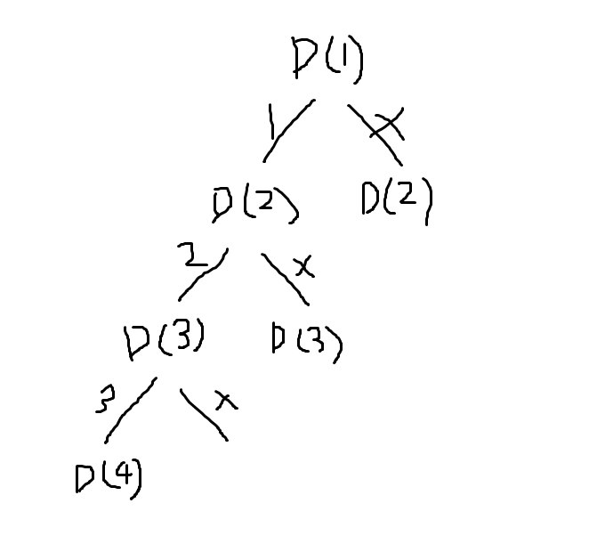

#키워드: `집합` `DFS` `체크리스트`
집합 문제는 체크리스트를 사용하는 대표적인 문제이다. 

체크리스트를 상용하기 위해선 `n+1`개 만큼 공간이 있는 체크리스트를 초기화한다.
index가 0인 첫 번째칸을 제외하고 나머지 칸을 체크리스트로 쓰면 된다.

재귀함수 부분의 else 코드는 
'''python
	ch[v] = 1
        DFS(v+1)
        ch[v] = 0
        DFS(v+1)
'''
위와 같이 적혀 있는데 이는 상태트리를 만들기 위함이다. 본 문제의 상태 트리는 다음과 같이 생겼다.

- 상태트리란 문제 해결 과정의 중간 상태를 각각 한 노드로 나타낸 트리를 상태 공간 트리(State-Space Tree)라고 한다.

본 문제에선 각 노드를 탐색한 경우(어떠한 상태가 된 경우) ch[v] = 1 을 통해 체크를 해주고 첫 번째 DFS(v+1)가 완료되면(탐색이 끝나면) 다시 이전 노드로 돌아갔다가 ch[v] = 0 으로 다른 노드를 탐색한다.(이전과 다른 상태가 됨) 결과적으로 이 과정을 반복하면 모든 부분 집합을 구할 수 있게 된다. 

머릿속으로 가지를 이동하는 가상의 선을 그을 수 있어야 한다.