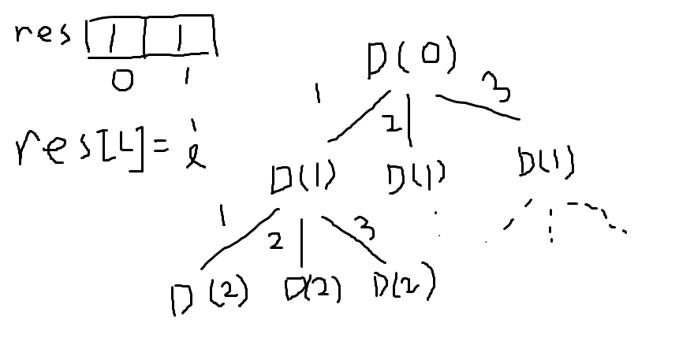

# 키워드: `DFS` `다중 트리` 
for문을 이용해 여러 가지 경우의 수를 탐색하는 문제이다. 가장 원초적인 형태의 문제는 중복 순열이며 하나의 노드가 여러 개의 엣지를 가지는 특징이 있다. 따라서 이진트리가 아닌 다중 트리 문제라고 볼 수 있다.

 

**중복 순열을 구하는 방법은 다음의 과정을 따른다.**
1.`res`라는 출력 대기 리스트를 만들어준다.
2.for문을 만들어 주고 안에 `res`를 넣어준다.
3.계층마다 `res`에 값을 초기화한다.(이때 `res`의 인덱스는 계층이 된다.)
4.계층이 m에 다다르면 `res`를 출력한다.

위의 과정을 통해 기초적인 다중 트리 형태를 만들어 낼 수 있다.