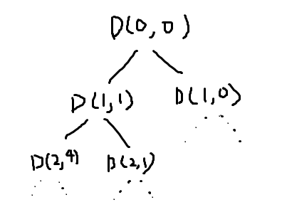

# 키워드: `DFS`
기존의 문제에서 살짝 응용이 들어간 DFS 문제이다. DFS의 매개변수 값으로 계층만 넣어주는게 아니라 합에 대한 정보도 넣어주었다. 합까지 넣어줄 경우 어떤 효과를 볼 수 있을까?
```python
	DFS(L+1, sum+a[L])
        DFS(L+1, sum)
```
재귀 함수에 대한 정보가 다음과 같이 주어졌을 때 상태 트리는 다음과 같이 그려진다.
<br>


<br>

이는 백트래킹을 할 때 계층뿐 아니라 sum 값까지 이전에 상태도 돌아온다는 뜻이다. 따라서 매개 변수로 sum을 넣어주면 모든 상태에 sum 값을 굳이 따로 계산해 줄 필요 없이 확인할 수 있게 되는 것이다!

추가로 주의해야할 점은 `print("NO")`가 어디에 들어가야 하는 점이다. "NO"는 모든 경우의 수를 확인하고도 "YES"가 안나올 경우 출력해주어야 한다. 그렇다는 것은 "NO"는 함수에 있어선 안된다. 함수 내부에 존재하는 한 어떻게든 NO가 출력될 수 밖에 없다. 따라서 "NO"는 main 함수에존재해야 한다.